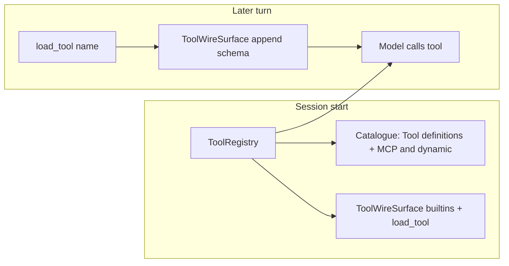

# Deferred MCP / dynamic tools (typed + TDD)

> **Status:** parked — do **not** land on `#109` / `feat/prompt-cache-prefix`. Follow-up PR after catalogue headers land.
>
> **Overview:** Defer non-builtin tool schemas off the OpenAI tools wire (Cursor/Anthropic dynamic-tools pattern), keep a typed MCP & dynamic catalogue in the brief, and promote schemas via a `load_tool` builtin — implemented TDD-first with frozen dataclasses, no dict/getattr soup.

## Todos

- [ ] RED/GREEN: `OpenAIFunctionTool` + `ToolWireSurface` unit tests and typed module
- [ ] RED/GREEN: `load_tool` builtin + `ToolLoadContext`; standing orders note
- [ ] Per-request `extra_params` resolution so promotions hit next turn
- [ ] Factory: builtins+`load_tool` eager; MCP/per-repo/skill deferred; catalogue unchanged
- [ ] Factory/adapter tests: wire omits dynamic until `load_tool`; catalogue still lists them

## Decision

Use a **skill-style `load_tool`**, not Cursor file sync and not Anthropic `defer_loading` (Dream’s OpenAI Chat Completions path has no server-side tool search).

| Slice | Wire (schemas) | Brief (catalogue) |
|-------|----------------|-------------------|
| Builtin (`ToolSource.DEFAULT`) | Eager on every turn | `# Tool definitions` name + one-liner |
| MCP / per-repo / skill | **Off wire until `load_tool`** | `# MCP & dynamic tools` name + one-liner |
| Skills / subagents | unchanged | `# Skills` / `# Subagent definitions` |

Dispatch already uses live `ToolRegistry` (not the wire), so deferred tools remain executable once the model knows the name — promotion only fixes **provider advertisement** for subsequent turns.

## Typed surface (no `dict` / `getattr`)

New module [`src/dream/tools/_wire.py`](../../../src/dream/tools/_wire.py):

- `OpenAIFunctionTool` — frozen dataclass: `name`, `description`, `parameters: Mapping[str, object]`; `to_wire_entry()` → OpenAI function-tool object
- `ToolWireSurface` — session-owned mutable advertisement:
  - `eager: tuple[OpenAIFunctionTool, ...]` (builtins + `load_tool`)
  - `loaded: tuple[OpenAIFunctionTool, ...]` (promoted dynamic tools, name-sorted for cache stability)
  - `entries() -> tuple[OpenAIFunctionTool, ...]`
  - `promote(tool: OpenAIFunctionTool) -> bool` (idempotent; reject unknown policy in caller)
  - `is_loaded(name: str) -> bool`
- Factory helper `openai_tool_from_base(tool: BaseTool) -> OpenAIFunctionTool` (uses `input_schema()`, special-case `spawn_subagent` stays in factory)

Adapter change: [`httpx_chat_completion_stream`](../../../src/dream/engine/_adapter_openai.py) accepts either a static `extra_params` mapping **or** a `Callable[[], Mapping[str, object]]` resolved **per request**, so promotions are visible next turn without rebuilding streamers. [`StreamerParts`](../../../src/dream/engine/_failover_wire.py) keeps `extra_params` but factory passes a closure that reads `ToolWireSurface.entries()`.

## `load_tool` builtin

[`src/dream/tools/builtin/load_tool.py`](../../../src/dream/tools/builtin/load_tool.py) (mirror [`skill.py`](../../../src/dream/tools/builtin/skill.py)):

- Input: `name: str`
- Context metadata key holds a typed `ToolLoadContext` (`wire: ToolWireSurface`, `registry: ToolRegistry`, `role_allowed: frozenset[str] | None`, deferred name set)
- Behavior:
  - refuse if not in deferred set / not in registry / role-denied
  - refuse if already builtin (noop message: already advertised)
  - `promote` schema onto `ToolWireSurface`
  - return compact schema + description so the model can call next turn
- Register as DEFAULT (eager on wire) in default registry / factory packs

Standing orders ([`common.md`](../../../src/dream/prompts/standing_orders/common.md)): before calling a tool listed only under MCP & dynamic tools, call `load_tool` first.

## Factory wiring

In [`_build_session_engine`](../../../src/dream/_factory.py):

1. Split `advertised_sourced` into builtin vs dynamic (`source.is_builtin`)
2. Catalogue still from full sourced list ([`ToolCatalogue.from_sourced`](../../../src/dream/tools/_catalogue.py) — already Cursor-shaped)
3. Build `ToolWireSurface` with builtin schemas + `load_tool` only
4. Put `ToolLoadContext` in tool metadata (same channel as skills)
5. `_session_extra_params` becomes surface-aware: emit `tools` / `tool_choice` from `surface.entries()` each call

## TDD sequence (red → green)

1. **`tests/test_tools/test_wire.py`** — `OpenAIFunctionTool` / `ToolWireSurface` promote, idempotent, stable order, empty→nonempty
2. **`tests/test_tools/test_builtin/test_load_tool.py`** — refuse unknown / role-denied / already-builtin; promote deferred; result contains name+parameters; second load idempotent
3. **`tests/test_engine/test_adapter_openai.py`** (or small new test) — callable `extra_params` sees mutation between two stream body builds (mock httpx or unit-test the closure merge)
4. **`tests/test_factory_session_extras.py` / factory integration** — session wire omits MCP-named tools at start; after synthetic `load_tool` execute, surface includes them; catalogue still lists MCP under `# MCP & dynamic tools`
5. Update existing catalogue / standing-order / spawn-enum tests already touched by the Cursor header rename

## Out of scope

- Cursor filesystem sync of MCP schemas
- Anthropic `defer_loading` / tool_search API
- Changing permission/trust ramp or MCP connect path (tools still register fully; only wire advertisement defers)
- Reworking prompt-cache breakpoints beyond accepting that promoting tools expands the tools prefix (same tradeoff as Cursor)

## Research notes

- Cursor: [Dynamic context discovery](https://cursor.com/blog/dynamic-context-discovery) — MCP schemas synced to files; brief gets names; ~47% token cut when MCP used.
- Anthropic: `defer_loading` + tool search — not available on Dream’s OpenAI-compatible path.
- Dream today: wire snapshotted at session engine build; dispatch uses live registry (callable without wire).
